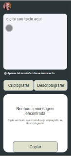

# Decodificador de Texto

Decodificador de texto que criptografa e descriptografa mensagens.

## Funcionalidades

- **Digite seu texto aqui:** Digite uma mensagem no campo "digite seu texto aqui".
- **Botão Criptografar:** Clique no botão Criptografar e o texto aparecerá criptografado na caixa de texto seguinte.
- **Botão Copiar:** Ao clicar em Copiar, o texto criptografado é copiado e gravado na área de transferência. Cole o texto novamente no campo "digite seu texto aqui".
- **Botão Descriptografar:** Clicando no botão Descriptografar, o texto é descriptografado voltando ao texto inicial que foi digitado.

## Demonstração

## Tecnologias Utilizadas

- HTML
- CSS
- JavaScript

## Autor

- [@LucianeBazzo](https://github.com/LucianeBazzo)

## Acesso ao Projeto

- [https://desafio-encriptadorv2.vercel.app/](#)  
  

